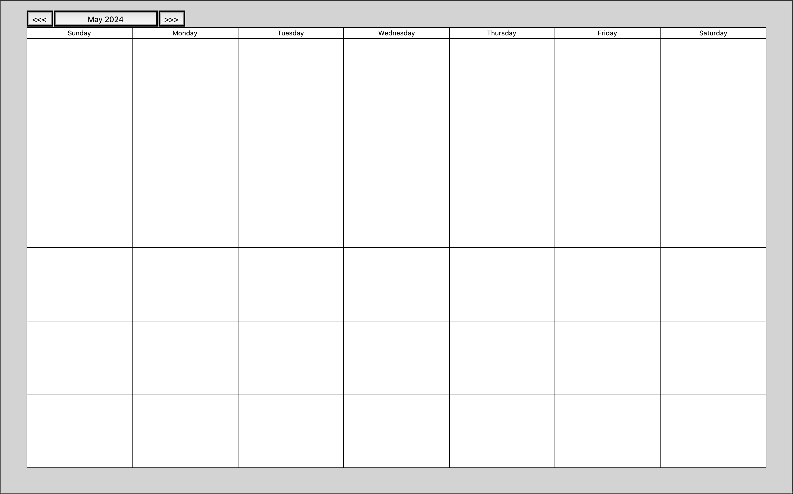
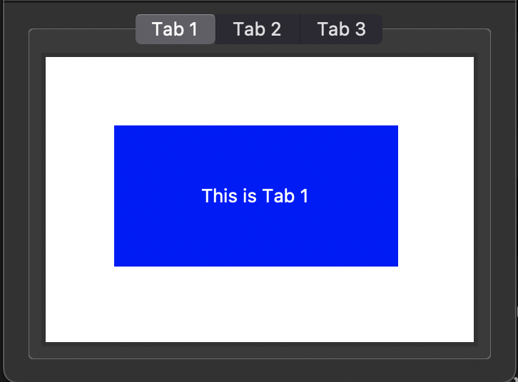
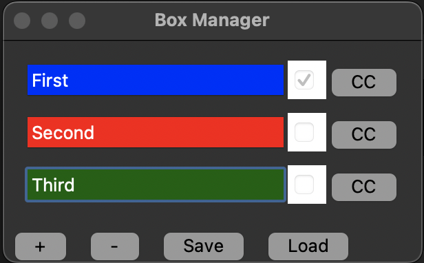
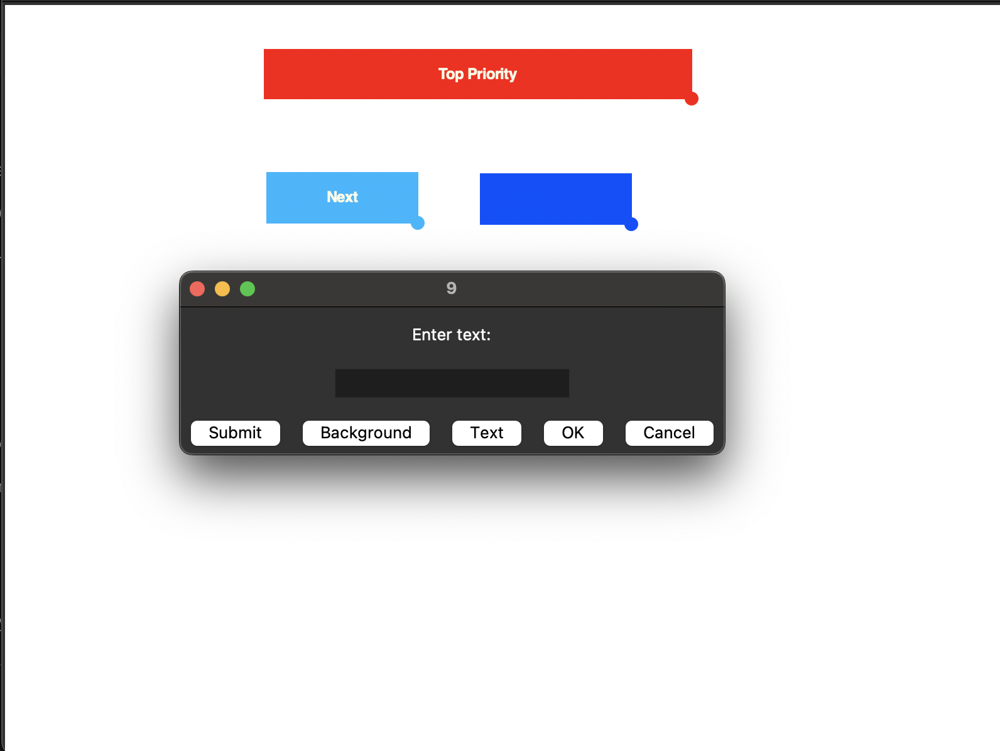

# Calendar Manager
Small project with different UI elements eventually for my personal use of management with a Sprint Calendar, Mind Map, Task Priority Manager and Graph of deadlines met to stay on schedule. main.py is the core application and the other files are exploritory UI modules for now.

## Tabs

## Task Manager

## Dragable Task Manager

## Mind Map
